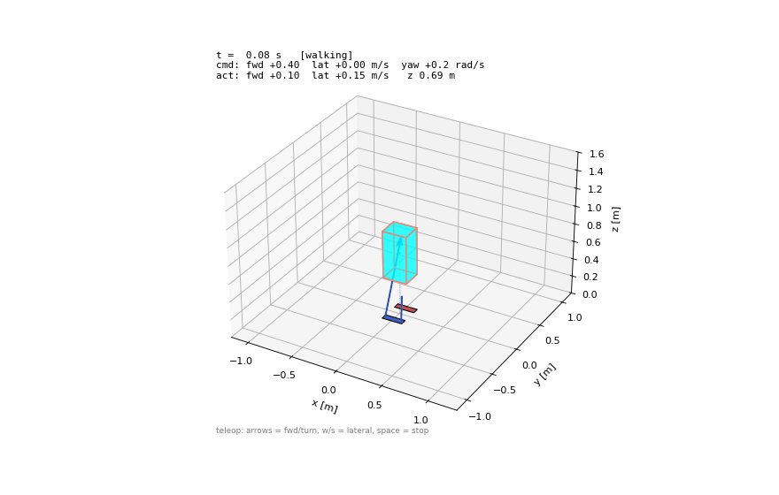

# G1 SRB-MPC

A single-rigid-body convex MPC for a Unitree G1-class humanoid, with a
nonlinear closed-loop walking simulation and a live 3D animation you can drive
from the keyboard.

The robot is modeled as one rigid body actuated by ground reaction forces at
four contact points (heel + toe on each foot — the heel/toe pair is what gives
the controller ankle torque and lets a biped balance in single support). Each
control tick condenses the linearized dynamics into a dense QP over the contact
forces, subject to a friction pyramid and normal-force limits. It's the MIT
convex-MPC formulation (Di Carlo et al., 2018) adapted to a line-foot biped.



## Files

- `srb_mpc_g1.py` — the controller (`SRBMPC`), gait scheduler, Raibert foot
  placement, a nonlinear closed-loop simulation, and a built-in ADMM QP solver.
  Run it directly for a headless demo that saves trajectory plots.
- `srb_mpc_viz.py` — the live 3D animation (`SRBDAnimator`) with keyboard
  teleop and GIF export. Imports from `srb_mpc_g1.py`, so keep them together.

## Install

```bash
git clone <your-repo-url>
cd g1_srb_mpc
pip install -r requirements.txt
```

Only `numpy`, `scipy`, and `matplotlib` are required. If `osqp` is installed it
is used as the QP backend; otherwise the built-in ADMM solver runs (no extra
install needed).

## Run

Live animation with keyboard control:

```bash
python srb_mpc_viz.py
```

Start it moving, or render a clip instead of opening a window:

```bash
python srb_mpc_viz.py --vx 0.6 --yaw-rate 0.3
python srb_mpc_viz.py --save walk.gif --t-end 6
```

Headless run that saves trajectory plots (velocity, attitude, foot forces to
`srb_mpc_walk.png`):

```bash
python srb_mpc_g1.py
```

## Controls (live window)

| Key           | Action                        |
|---------------|-------------------------------|
| `↑` / `↓`     | forward speed  ± 0.1 m/s      |
| `←` / `→`     | turn rate      ± 0.2 rad/s    |
| `w` / `s`     | lateral speed  ± 0.05 m/s     |
| `space`       | stop (zero all commands)      |

The HUD shows commanded vs. actual body-frame velocity and CoM height. Red/blue
arrows are the heel and toe ground-reaction forces on each stance foot; the
dashed outline is the planned next footstep.

## Notes

- The simulation is a genuine closed loop: the MPC optimizes against its
  linear prediction, but the returned forces are integrated through the
  nonlinear rigid-body dynamics, and that state is fed back.
- Physics run at 500 Hz; the MPC re-solves at 25 Hz (`dt = 0.04 s`,
  10-step / 0.4 s horizon).
- On real hardware the contact forces map to stance-leg joint torques via
  `tau_i = J_i^T (-f_i)`, with a swing-leg tracking controller for the feet.

## Reference

J. Di Carlo, P. M. Wensing, B. Katz, G. Bledt, S. Kim,
"Dynamic Locomotion in the MIT Cheetah 3 Through Convex Model-Predictive
Control," IROS 2018.
